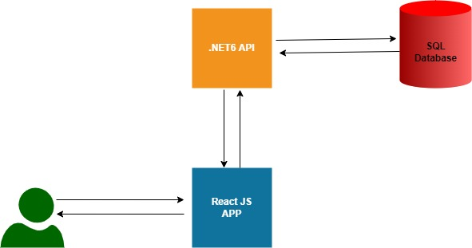
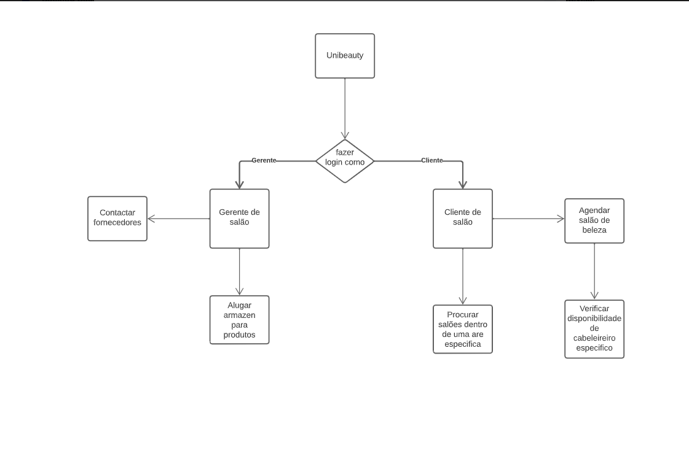

# Uni Beauty Wiki

## Sobre

Uni Beauty tem como finalidade uma plataforma que possa ser utilizada para gerir salões e facilitar o agendamento de serviços para o consumidor.

 

## Arquitetura

 

### Arq. Produto Completo

Documentação de arquitetura oficial: https://docs.google.com/document/d/1N6Li7xuNBAbIvMKiBnQfQ_gvkL4_Kx6a/edit#

### Arq. MVP

Para o MVP iremos seguir uma arquitetura mais simples em relação ao produto inicialmente idealizado, por conta do tempo curto de desenvolvimento.

Basicamente teremos uma aplicação cliente em React que rodará no browser, esse cliente vai requisitar dados para uma API desenvolvida em .NET6, esta API vai persistir os dados em um banco PostgreSQL.

 

## Mínimo Produto Viável (MVP)

 

### Necessidades do usuário

É preciso ter os endereços e contatos de salões de beleza associados para os clientes.

É preciso ter contato com os fornecedores associados para os donos de salões.

É preciso ter locais apropriados para os salões associados estocarem e conservarem seus produtos.

 

## Mapa de Funcionalidades

## Cenário de Uso e Exemplo de Aplicação

Em salão de beleza, existe um livro de agendamento para gerenciar os serviços oferecidos aos seus clientes. A proprietária do salão percebe que essa abordagem está causando problemas de agendamento e atrasos no atendimento, o que afeta negativamente a experiência do cliente e a eficiência operacional do negócio.

A proprietária então pesquisa e encontra a plataforma oferecida pelo projeto UniBeauty, que permite que ela gerencie as agendas dos profissionais do salão, monitore os serviços que estão sendo agendados e forneça aos clientes uma interface amigável para reservar seus horários preferidos.

Ela entra em contato com a equipe de desenvolvimento do projeto e inicia a implementação da plataforma em seu salão. A equipe de desenvolvimento trabalha em estreita colaboração com a proprietária do salão para implantar o sistema e treinar a equipe do salão em como usar a plataforma de forma eficaz.

Após a implantação, a proprietária do salão observa que a plataforma facilita significativamente o processo de agendamento, eliminando os atrasos e reduzindo as chances de erro humano. Os clientes do salão também estão satisfeitos com a experiência de agendamento simplificada e o serviço prestado de forma mais eficiente.

Com a ajuda da plataforma oferecida pelo projeto UniBeauty, a proprietária do salão pode gerenciar seu negócio com mais eficiência, garantindo uma melhor experiência para seus clientes e aumentando sua receita.

## Desenvolvimento

### Frontend

Guilherme, Joao Vitor e Eduardo

### Backend

Brunno, Gustavo e Arthur
